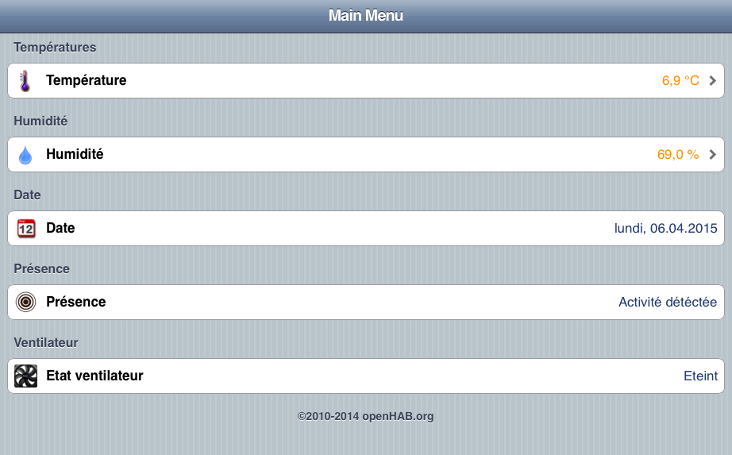
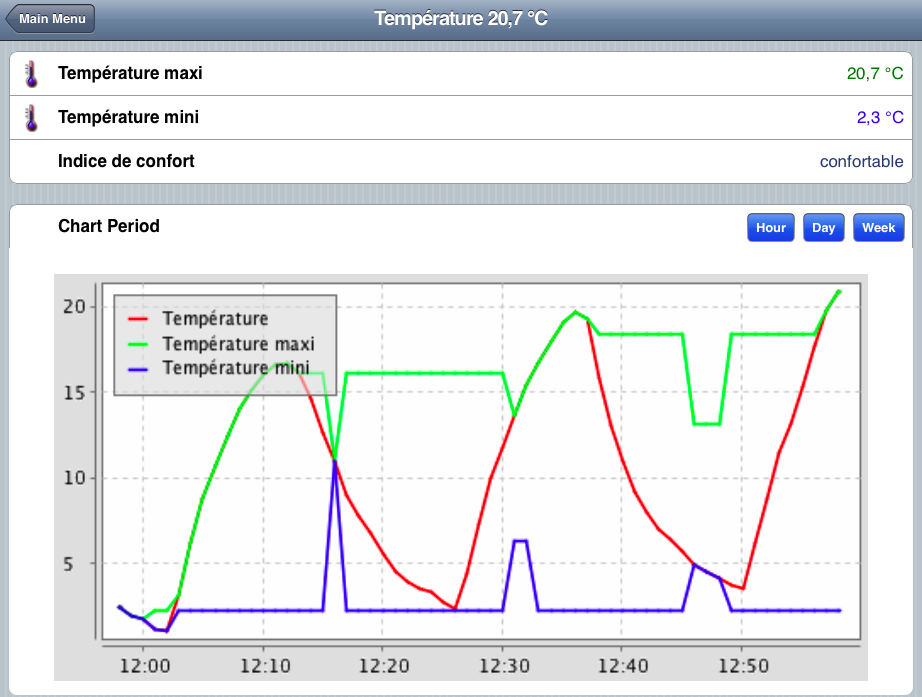
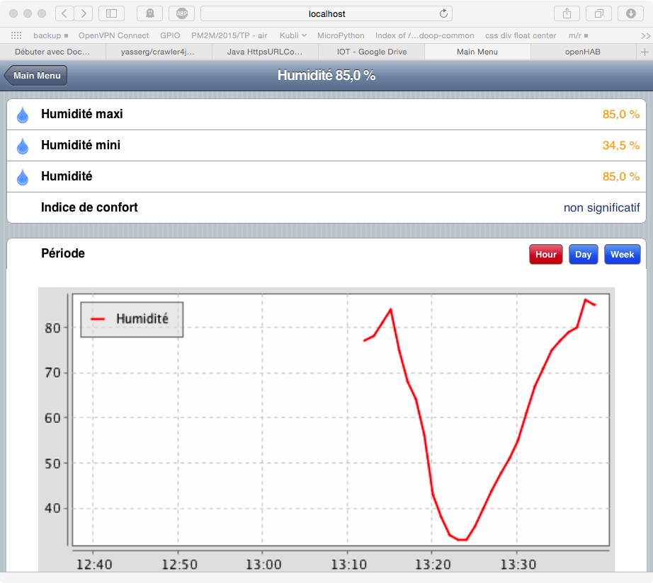
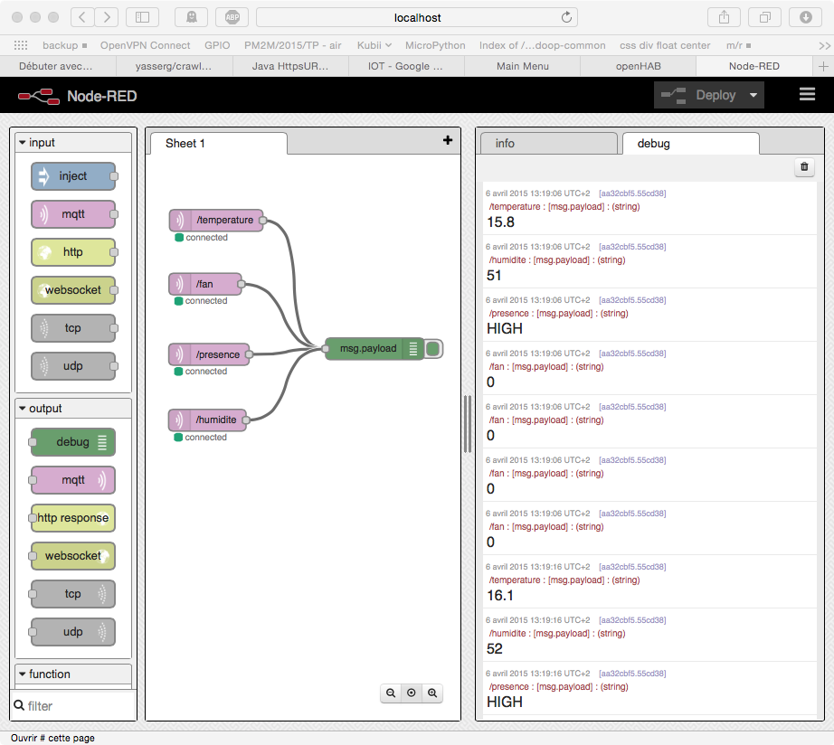

#SmartCooling
- スマート クーリング
- Controle d’un ventilateur en fonction de la temperature et de la détection de présence dans une pièce.
- Projet réalisé dans le cours de M2M donné à l'UFRIM2AG : http://air.imag.fr/index.php/PM2M/2015/TP

##Auteurs
- Marc-Alexandre BLANCHARD
- Morgan CHABOUD

##Prérequis matériels
- Un capteur de température (DHT11)
- Un capteur de présence (PIR 555-28027)
- Un arduino méga (ou autre, pour les arduino gallileo, il sera ,nécessaire de reécrire les dépendances envers ethernet) avec un shiel ethernet
- Un ventilateur
- Un arduino galileo avec une linux.
- Un circuit électronique permettant le controle du ventilateur
- Un réseau domestique (type box adsl avec DHCP)
- Un serveur hébergeant Mosquitto et OpenHab, sur une ip fixe et connu.

##Montage
- Architecture globale
- 
- Carte arduino + capteur
- 
- Carte galileo + controle du ventilateur
- 
- Schemas éléctrique
-  

##Prérequis logiciels
- Le programme python de controle du ventilateur
- Le sketch de lecture des données

##Fonctionnement global
- Une carte arduino connecté à divers capteurs (temperature et humidité) publie sur un borker MQTT les valeurs des différents capteur.
- Le serveur via OpenHab offre une interface de visualisation ainsi qu'un moteur de règle. Le moteur de règle déclenche ou non le démarrage du ventilateur en fonction des valeurs remonté par la carte arduino.
- Pour déclencher le ventilateur le serveur publie sur un topic dédié.
- Le ventilateur connecté à une carte intel Galiléo écoute ce topic et ajuste le la vitesse du ventilateur : éteint, vitesse moyenne, vitesse forte.

##Ce qui est fournit dans ce dépot
- Le sketch de lecture des données (testé sur arduino méga avec un shiel ethernet), **arduino/sketches**
- Le script python de control du ventilateur, **galileo/dev**
- La configuration d’OpenHab, **serveur/OpenHab**
- La présentation pdf de la soutenance **/presentation**
- Les images présentes dans ce readme **/images**

##OpenHab
Les capacités d’OpenHab sont : 
- Affichage des temperatures mini et maxi de la journée.
- Affichage de l’himidité mini et maxi de la journée.
- L’indice de confort actuel
- Les courbes de temperatures horaire, journalière et hebdomadaire.
- Les courbes d’humidité horaire, journalière et hebdomadaire.
- L’activité dans la pièce (oui / non)
- L’etat du ventilateur

##Libraires utilisées
- GPIO pour python
- MQTT pour python
- Skecth de lecture des données pour dht11, modifié par nos soins pour émettre sur mqtt et permettre la lecture du capteur de présence source : https://skyduino.wordpress.com/2013/04/27/tuto-capteur-temperature-humidite-dht11/

##Screenshots
- Interface générale d'OpenHab
- 
- Interface générale d'OpenHab (Greent)
- ")
- Interface de temperature d'OpenHab
- 
- Interface d'humidité d'OpenHab
-  
- Interface Nodered utilisé pour la visualisation des flux
- 
- Script python
- 
- 

